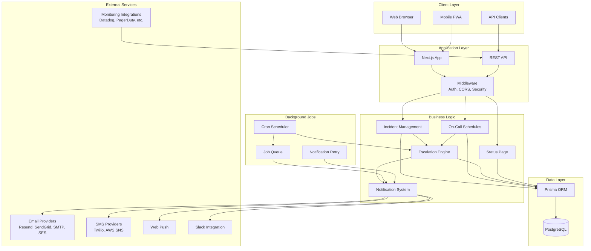
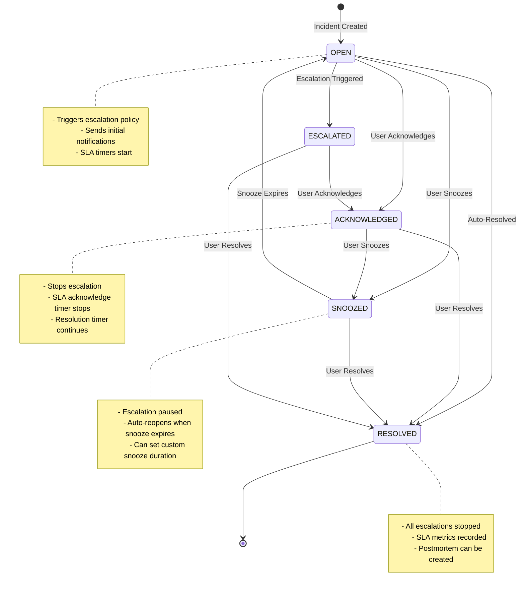
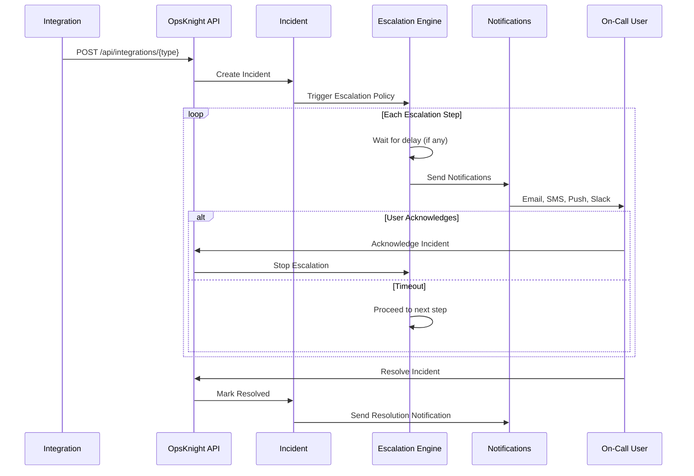
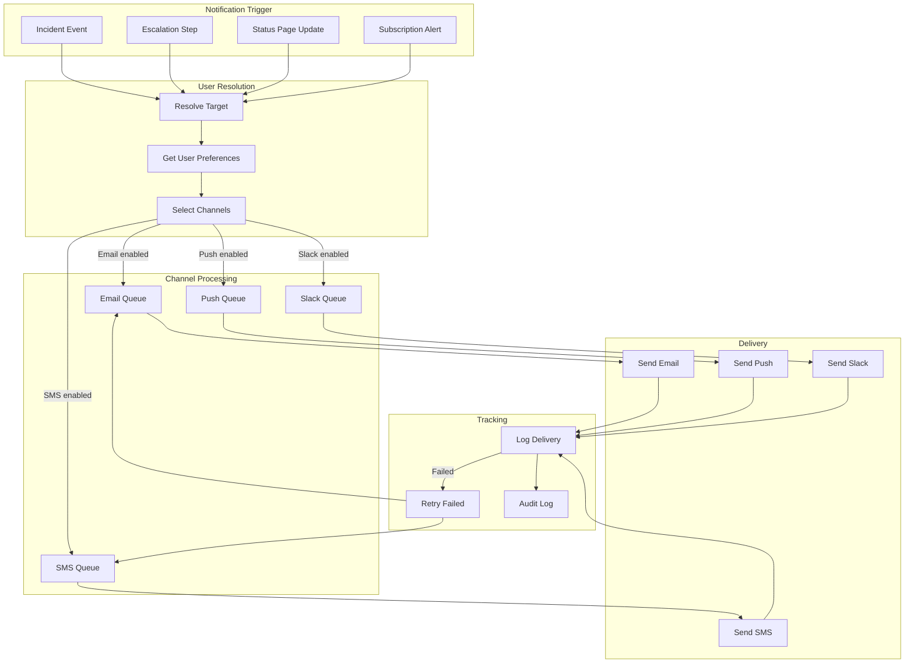
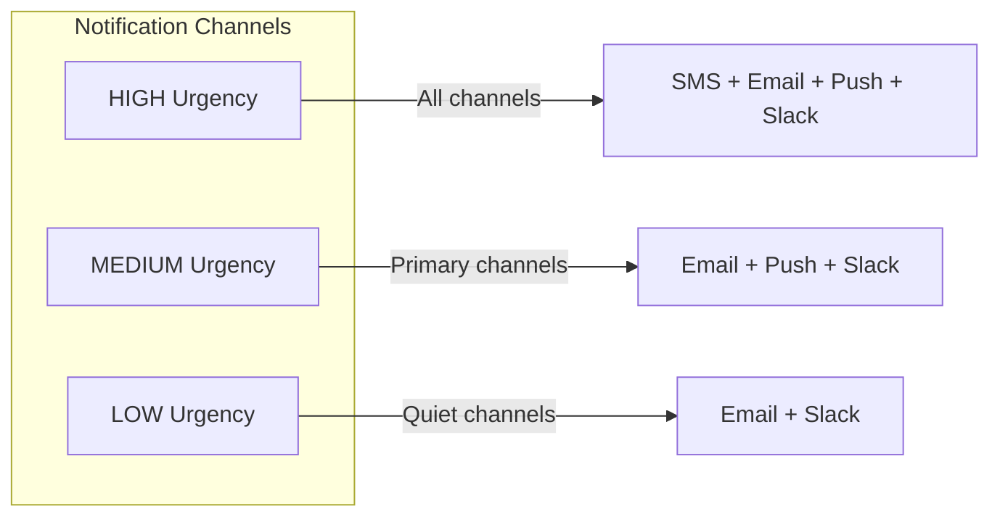
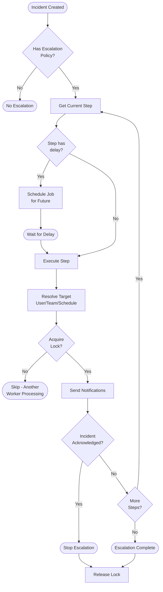
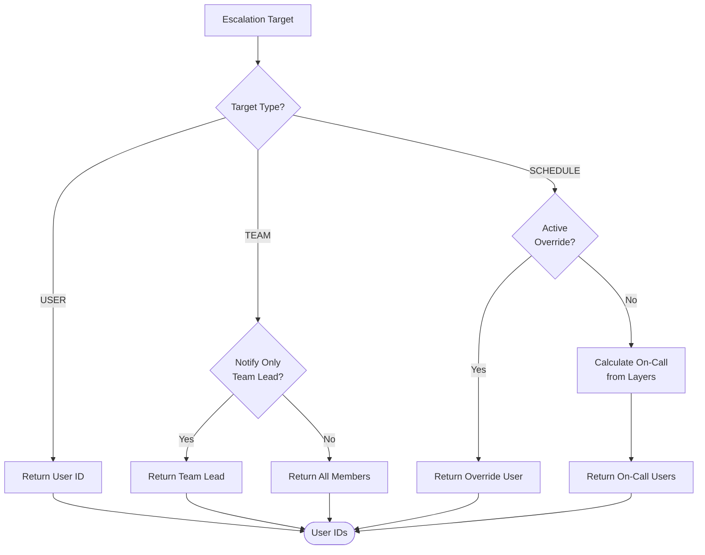
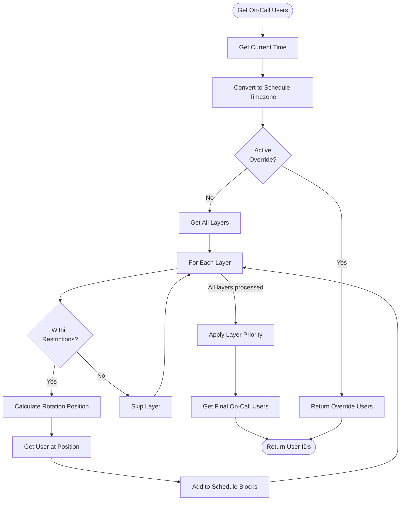
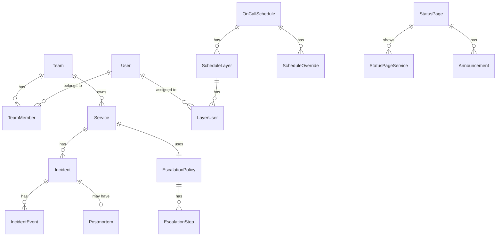

# Architecture Diagrams

This document provides visual representations of OpsKnight's architecture and key workflows.

## Table of Contents

- [High-Level System Architecture](#high-level-system-architecture)
- [Incident Lifecycle Flow](#incident-lifecycle-flow)
- [Notification Delivery Pipeline](#notification-delivery-pipeline)
- [Escalation Engine Flow](#escalation-engine-flow)
- [On-Call Schedule Resolution](#on-call-schedule-resolution)

---

## High-Level System Architecture

This diagram shows the main components of OpsKnight and how they interact.

---

## Incident Lifecycle Flow

This diagram shows how an incident progresses through its lifecycle.

### Incident Events Timeline

---

## Notification Delivery Pipeline

This diagram shows how notifications are processed and delivered.

### Notification Priority

---

## Escalation Engine Flow

This diagram shows how the escalation engine processes escalation policies.

### Escalation Target Resolution

---

## On-Call Schedule Resolution

This diagram shows how on-call schedules are resolved to determine who is currently on-call.

### Schedule Layer Example

```mermaid
gantt
    title On-Call Schedule (24 hours)
    dateFormat HH:mm
    axisFormat %H:%M

    section Layer 1 (Primary)
    User A :a1, 00:00, 8h
    User B :a2, 08:00, 8h
    User A :a3, 16:00, 8h

    section Layer 2 (Backup)
    User C :b1, 00:00, 12h
    User D :b2, 12:00, 12h

    section Override
    User E (Override) :crit, o1, 14:00, 4h
```

---

## Database Schema Overview

Key entity relationships:

---

## Component Interaction Summary

| Component           | Interacts With            | Purpose               |
| ------------------- | ------------------------- | --------------------- |
| Next.js App         | All components            | Request handling, SSR |
| Prisma ORM          | PostgreSQL                | Data access           |
| Cron Scheduler      | Escalation, Jobs, Rollups | Background processing |
| Escalation Engine   | Schedules, Notifications  | Incident routing      |
| Notification System | Email, SMS, Push, Slack   | Message delivery      |
| Status Page         | Services, Incidents       | Public visibility     |
| Integrations        | External monitoring tools | Alert ingestion       |
